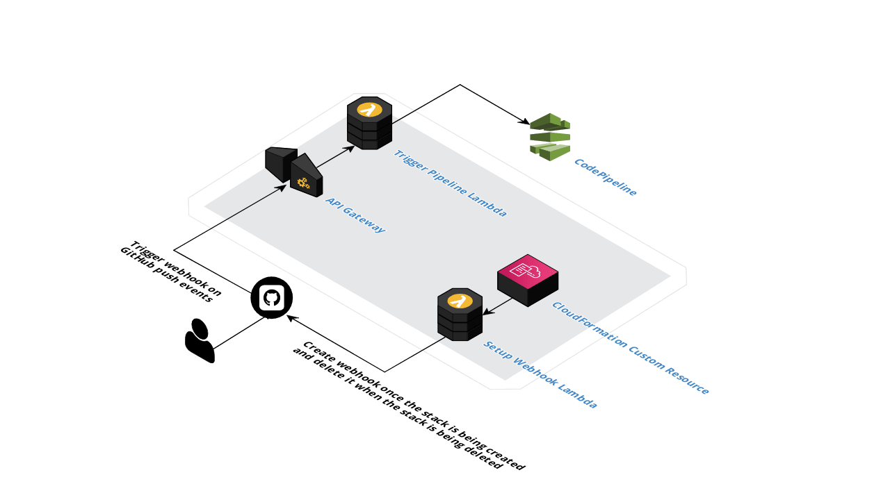

# codepipeline-github-skip-executions

The CodePipeline allows setting up the webhook out of the box through the `AWS::CodePipeline::Webhook` resource. It also has a `Filters` property which allows providing custom filters on when the webhook should start the pipeline, but I wasn't able to find how to set up complicated rules (e.g. trigger pipeline execution only when the specific files have been updated), it's also restricted to have maximum 5 filters.

This project was initially created as an internal tool since I wanted to have complete control over when the pipeline execution should be started or when it should be skipped.

## Architecture



## Deployment

Since it interacts with GitHub, it requires the OAuth token to be generated with the following scopes:
- `repo` (Full control of private repositories)
- `admin:repo_hook` (Full control of repository hooks)

The token should be stored in AWS Secrets Manager. This can be done by running the following command:

```sh
$ aws secretsmanager create-secret \
  --name GithubOAuthToken \
  --secret-string "{\"GithubOAuthToken\":\"your_token_here\"}"
```

The `GithubOAuthToken` name is hardcoded in this project, but it may be changed if your secret is named differently.

The `cloudformation/codepipeline.stack.yml` creates an example stack with CodeBuild and CodePipeline, and it may be used for further steps.

The `sls deploy` requires the following parameters to be provided:

- `s3Bucket` - the deployment bucket
- `pipelineName` - the CodePipeline name
- `githubBranch` - the GitHub branch which is used to track `push` events (e.g. `main`)
- `githubUser` - the name of the user or organization
- `githubRepository` - the name of the repository
- `ssmHookIdParameterName` - the name of the SSM parameter used to store the created GitHub webhook (e.g. `/github/hook_id`)
- `watchedFiles` - the glob pattern of files that should trigger pipeline on changes (e.g. `{libs,apps}/**/*.ts`)

The `deploy.example.sh` contains a set of scripts used to deploy the complete infrastructure; it just needs variables to be replaced with actual values.
